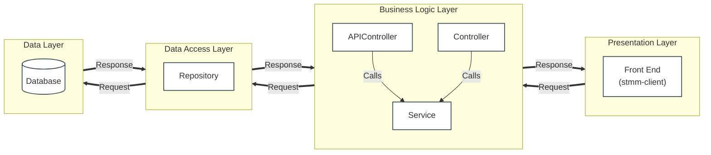
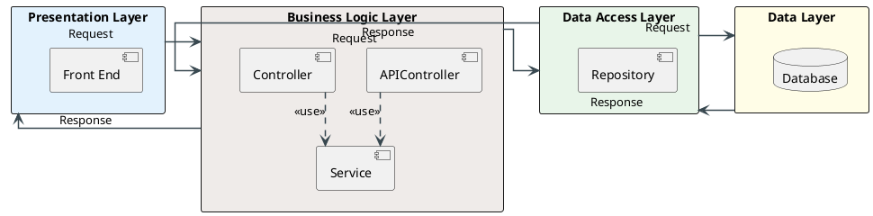

# System Architecture - Food Haven (STMM)

Tài liệu này mô tả sơ đồ kiến trúc hệ thống đầy đủ (Full System Architecture) theo phong cách slide bài giảng chuẩn (University Style) với các đường kết nối **gấp khúc (ortho)** ở ngoài vỏ bọc tầng (Package-to-Package), đồng thời thể hiện **tương tác nội bộ** giữa các thành phần bên trong **Business Logic Layer**.

---

## 1. Sơ đồ Kiến trúc Hệ thống (Mermaid)

Dưới đây là sơ đồ chi tiết biểu diễn luồng đi của Request/Response ở cấp độ tầng và chi tiết kết nối nội bộ:

---

## 2. Mã nguồn PlantUML chuẩn Slide (Gấp khúc ngoài vỏ, tương tác trong)

Mã nguồn **PlantUML** dưới đây được tối ưu theo đúng mong muốn của bạn:
* Các đường mũi tên `Request` và `Response` sẽ nối trực tiếp vào **vỏ ngoài của các hộp lớn (Tầng/Package)**, không nối trực tiếp vào các thành phần nhỏ.
* Các mũi tên giao tiếp được cấu hình **gấp khúc 90 độ (`linetype ortho`)**.
* Có thể hiện **tương tác nội bộ** bên trong tầng Business Logic (`APIController` và `Controller` gọi tới `Service`).

